# Vanguard-builder
A supplementary application to the Trading Card Game, Cardfight! Vanguard. A combination of deck builder and card search engine.
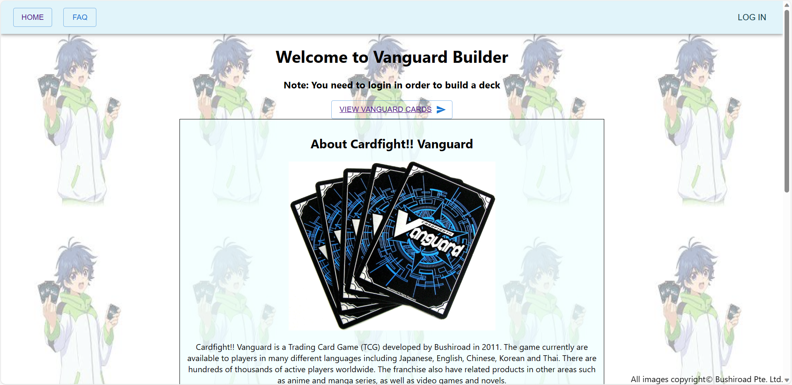
 

# How to use the application
For optimal experience, create an account and login by clicking the LOG IN button at top right corner. This should direct you to the login screen.
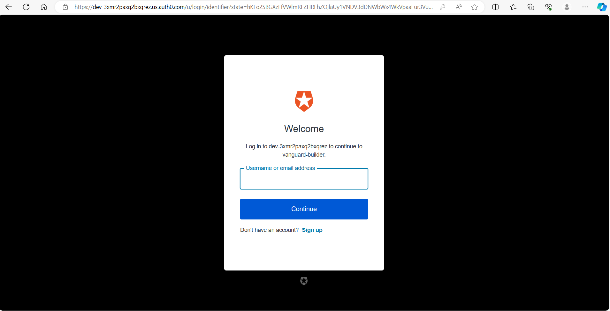
 
Sign up or log in to your account. If you have existing decks created, it should show up on the home page.

## Deck builder
 Click on view cards (if not logged in) or deck builder (logged in) button to view cards available for deck building. The cards are
 filtered by their grade and nation by default. Click on the filter citerias at bottom of sceen to modify them. Scrolling over the cards to view detailed card name and effect.
  
 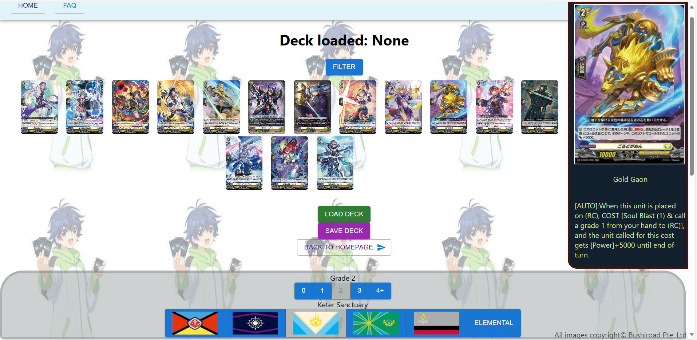
  
 Left click to add cards to your deck, remove them by right clicking. Number of selected card currently in your deck is shown by the number on it. You may add the card into your ride deck by Ctrl+left clicking on it. Remove it from ride deck by Ctrl+right click.
  
 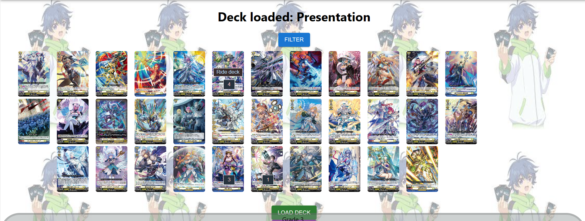
  
 You may load an existing deck by clicking the Load Deck button and select the deck to load from the pop-up. Loaded deck name will show at the top.
 You may save the current deck using the Save Deck button.
  
 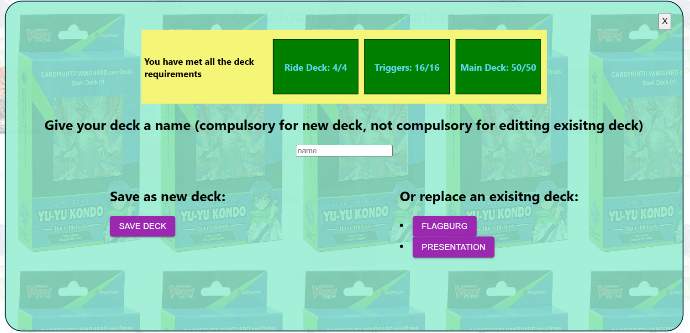
  
 Note the three condition to a legitimate Vanguard deck. You may only save a deck if all the conditions are met. 
 For new deck: Give your deck a name and click the SAVE DECK button.
 For editting existing deck: Put a new name for the deck if you want to change its name. Select the existing deck to save over.

## Card searcher
 You may search for a particular card or a particular group of cards from the card list. This feature is available to all users even if not logged in.
  
 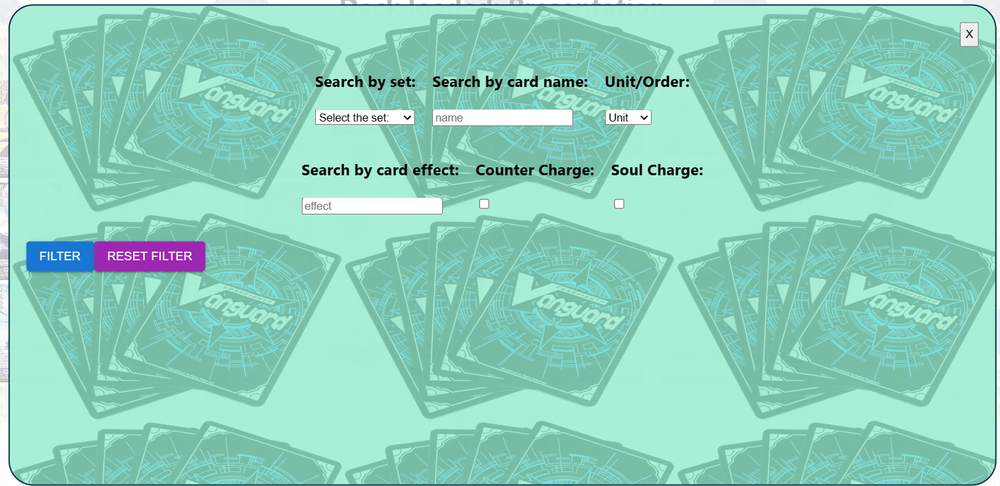
  
 You can narrow the cards displayed further by their card set, card name, effect, type, or whether or not the card has a counter charge or soul charge effect.

## Deck list display
 You can view your constructed deck lists in detail by clicking on them at the home screen.
 The deck list will be displayed in three portions: ride deck, triggers, and main deck. Just like in card list display, you may view
 the details of the cards by scrolling over them.

 Ride deck will display the 4 cards in it, from grade 0 to grade 4.
 Triggers portion displays all 16 trigger cards, while also display the trigger types line up at the bottom:
  
 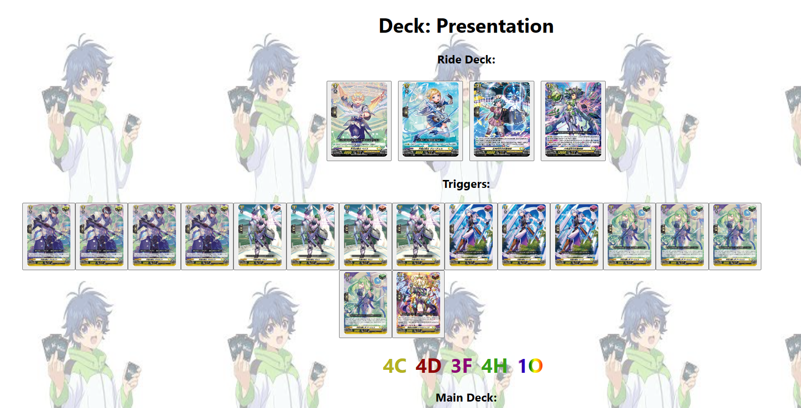
  
 Main deck list will have all 30 remaining cards organised by their name and quantity, as well as any important additional information
 like sentinel key word or order types.
  
 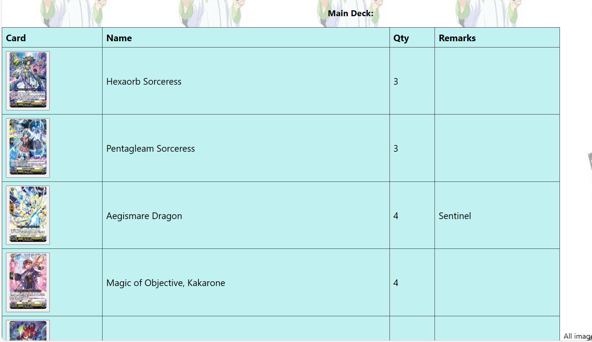
  
 At the bottom of the page, you may choose to export the deck list as a single image, containing all the 50 cards:
  
 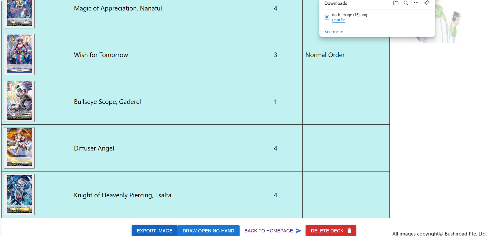
  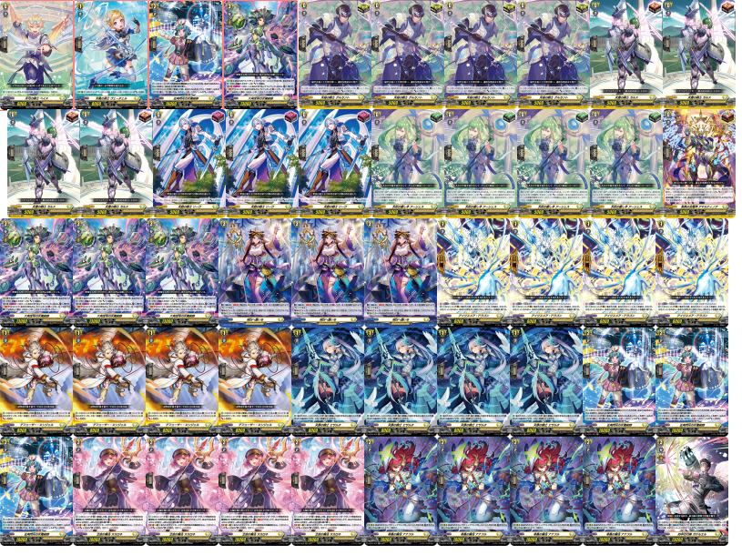
  
 Deck display also provides a feature that lets player draws a sample opening hand of 5 cards, just like in a normal game.
 Players may use this feature to test for chances of a certain card to appear in opening hand, or familiarise with what
 card to mulligan in an actual game.
  
 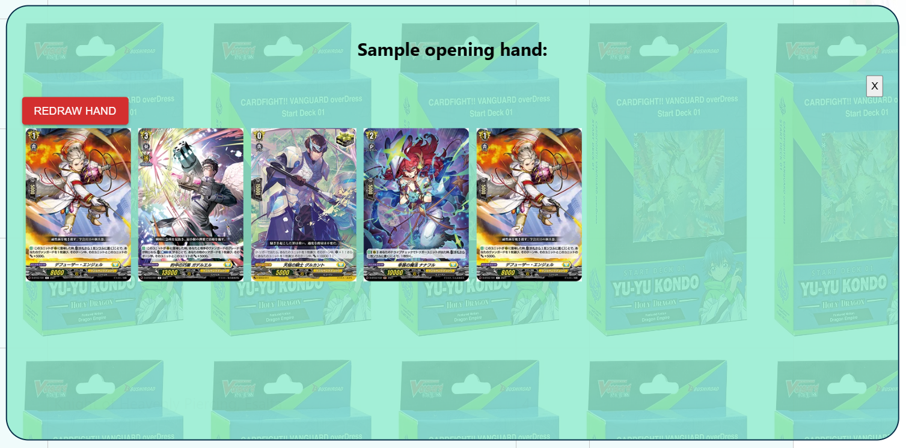
  

## FAQ
For more information you can read up the FAQ and click on the links for better details from the wiki site.